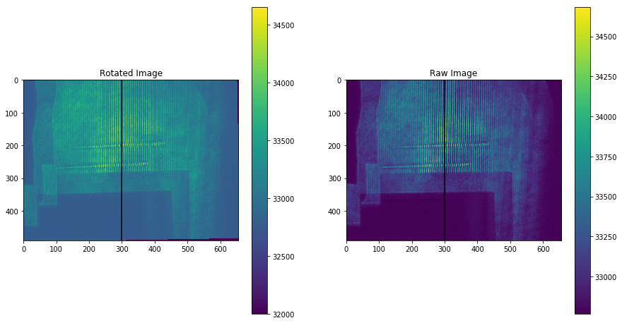
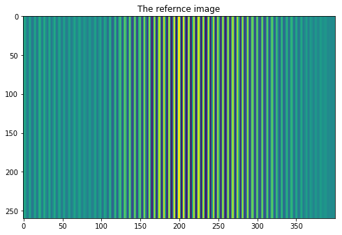
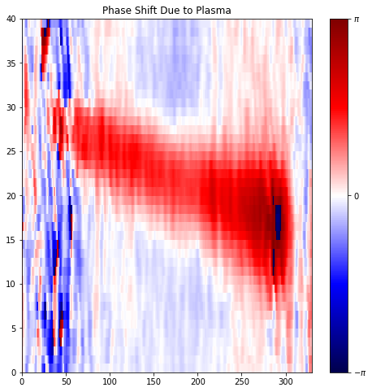
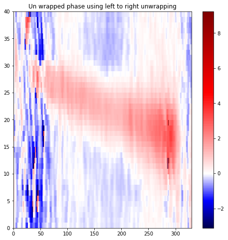

# Inteferometry Analysis

This code has been written in python 3.

## Code Structure
1. Import data to numpy array
2. Rotate fringes to vertical, and create reference if required.
3. Remove background, and crop to ROI
4. Create reference image from fringes
5. Recreate phase
6. Unwrap phase
7. Return Density.

## Stages
Rotating the fringes to vertical

Inteferogram reference - Created from the lines above the plasma channel

Looking at the difference in angle between the reference and image we get the phase shift:

This phase needs to be unwrapped, we can see the peak denisty region has wrapped around by 2 pi.

The unwrapped phase, showing the removal of the dark spot at the peak density, and instead wrapped phase and it is now (almost) smooth.

The density is then extracted using an abel transform, implemented using pyabel.

### Experimental Data Database
I create an experimental data base of all the shot data.
I will then be able to read from this once the rest of the code is working, to allow batch operation

## Running with a virtualenv 
To activate this project's virtualenv, run pipenv shell.
Alternatively, run a command inside the virtualenv with pipenv run..
